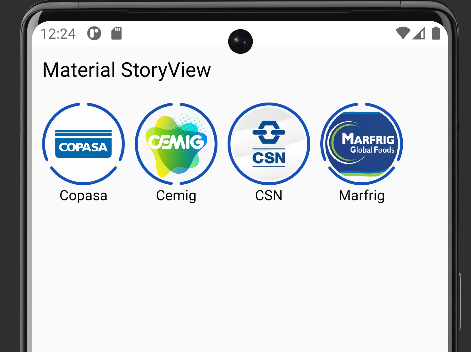
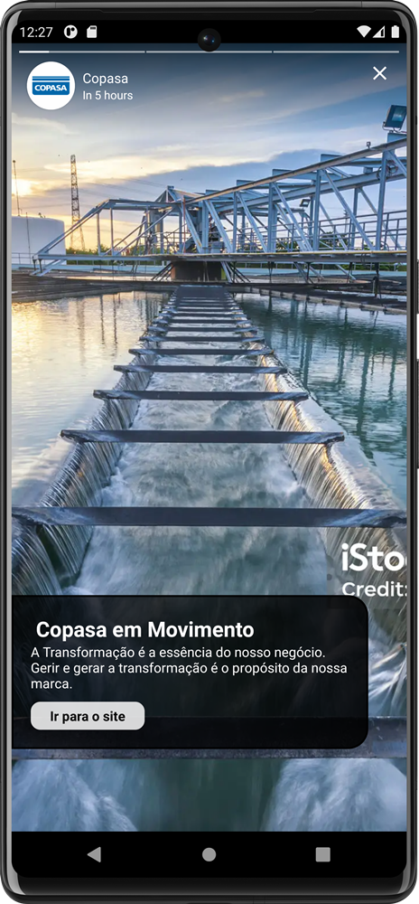

# StoryView

You can read this in engligh (https://github.com/welbert6/MaterialStoryView/blob/master/README.md)

## Screenshots





## Introdução

MaterialStoryView é uma biblioteca Android para implementação de um carrossel de histórias, similar ao encontrado em redes sociais como Instagram e Facebook. Esta biblioteca facilita a adição de um componente de visualização de histórias em sua aplicação Android, permitindo uma integração fácil e rápida.

✅ Salva story como visto no SharedPreferences: Garante que os usuários não vejam repetidamente a mesma história, melhorando a experiência de uso.

✅ Botão para ação no story: Permite interações diretas, como visitar um link ou realizar uma ação específica, diretamente da história.

✅ Navegação entre stories tocando no lado direito e esquerdo da tela: Facilita a navegação entre as histórias, permitindo que os usuários avancem ou retrocedam com um simples toque.

✅ Oferece suporte para RTL e LTR: Acomoda usuários de idiomas que são lidos da direita para a esquerda (RTL) e da esquerda para a direita (LTR), garantindo uma experiência de usuário global e inclusiva.

✅ Oferece suporte para stories com título e sem título: Flexibilidade para exibir histórias tanto com títulos para contextualização quanto sem títulos para um design mais limpo.

✅ Personalização 100%: Permite ajustar completamente a aparência das histórias, incluindo duração, cor de indicação, tamanho do raio da imagem, cor do texto, etc., para se adequar perfeitamente à identidade visual da sua aplicação.


## Como Implementar

Para adicionar o carrossel de histórias em sua activity, siga os passos abaixo:

#### 1. Add the gradle dependency

Para usar MaterialStoryView em seu projeto, adicione a seguinte dependência ao seu arquivo build.gradle:
```
allprojects {
		repositories {
			...
			maven { url 'https://jitpack.io' }
		}
	}
```
e a dependencia:
```
dependencies {
	       	        implementation 'com.github.welbert6:MaterialStoryView:1.0.0'
	}
```
#### 2. Uso 

Adicionar o CarouselStoryView ao seu layout XML:

```xml 
<com.moreirasoft.materialstoryview.presentation.customviews.CarouselStoryView
    android:id="@+id/carouselStoryView"
    android:layout_width="match_parent"
    android:layout_height="wrap_content"
    android:orientation="horizontal"
    android:layout_margin="10dp"
    app:miniStoryTextColor="#000"
    app:miniStoryImageRadius="36dp"
    app:miniStorySpaceBetweenImageAndIndicator="2dp"
    app:miniStoryItemIndicatorWidth="3dp"
    app:storyDuration="6000" />

```
#### Inicializar e configurar o CarouselStoryView na sua Activity:


```java
val carrosselStoryView: CarouselStoryView = findViewById(R.id.carouselStoryView)

// Certifique-se de chamar esse metodo para inicilizar a lib
carrosselStoryView.initWithActivity(this)

// Você pode adicionar um unico story ou uma lista de story e ainda pode adicionar dinamicamente
carrosselStoryView.addStory(getCopasaStories())
carrosselStoryView.addStory(getCemigStories())
carrosselStoryView.addStory(getCminStories())
carrosselStoryView.addStories(getModelStorys())
````

#### Personalização


MaterialStoryView oferece várias opções de personalização através de atributos XML, permitindo a modificação de:

    Tamanho e cor do texto
    Cores dos indicadores de histórias visitadas e pendentes
    Raio da imagem da história
    Largura do indicador do item da história
    Duração da história

Para mais detalhes sobre as opções de personalização, consulte as opções disponíveis na seção de atributos declare-styleable do XML.
For more details on customization options, refer to the available options in the declare-styleable XML attributes section.

<declare-styleable name="MaterialCarouselStoryView">
        <attr name="miniStoryTextSize" format="dimension"/> 
        <attr name="miniStoryTextColor" format="color"/>
        <attr name="miniStoryTextFont" format="reference"/>
        <attr name="miniStoryVisitedIndicatorColor" format="color"/>
        <attr name="miniStoryPendingIndicatorColor" format="color"/>
        <attr name="miniStoryImageRadius" format="dimension"/>
        <attr name="miniStorySpaceBetweenImageAndIndicator" format="dimension"/>
        <attr name="miniStoryItemIndicatorWidth" format="dimension"/>
        <attr name="storyProgressBarPrimaryColor" format="color"/>
        <attr name="storyProgressBarSecondaryColor" format="color"/>
        <attr name="storyProgressBarHeight" format="dimension"/>
        <attr name="storyGapBetweenProgressBar" format="dimension"/>
        <attr name="storySingleStoryDisplayTime" format="integer"/>
        <attr name="storyDuration" format="integer"/>
    </declare-styleable>

- miniStoryTextSize (Tamanho do Texto da Mini Story): Define o tamanho do texto das legendas das mini stories, permitindo a personalização da escala de texto para melhor legibilidade.
- miniStoryTextColor (Cor do Texto da Mini Story): Especifica a cor do texto das legendas das mini stories, oferecendo a possibilidade de harmonizar a cor do texto com o tema do aplicativo.
- miniStoryTextFont (Fonte do Texto da Mini Story): Permite definir a fonte do texto das mini stories através de uma referência, possibilitando a personalização da tipografia para se alinhar à identidade visual.
- miniStoryVisitedIndicatorColor (Cor do Indicador de Visitado da Mini Story): Define a cor do indicador para as stories que já foram visualizadas pelo usuário, ajudando na distinção entre conteúdo novo e revisado.
- miniStoryPendingIndicatorColor (Cor do Indicador Pendente da Mini Story): Especifica a cor do indicador para as stories que ainda não foram visualizadas, facilitando a identificação de novos conteúdos.
- miniStoryImageRadius (Raio da Imagem da Mini Story): Determina o raio das imagens nas mini stories, permitindo arredondar os cantos das imagens para um visual mais suave.
- miniStorySpaceBetweenImageAndIndicator (Espaço entre Imagem e Indicador da Mini Story): Define o espaço entre a imagem da mini story e seu indicador, permitindo um ajuste fino do layout para melhor apresentação visual.
- miniStoryItemIndicatorWidth (Largura do Indicador do Item da Mini Story): Especifica a largura do indicador de progresso das mini stories, permitindo personalizar a espessura para maior visibilidade ou discrição.
- storyProgressBarPrimaryColor (Cor Primária da Barra de Progresso da Story): Define a cor primária da barra de progresso, que pode ser personalizada para se alinhar ao esquema de cores do aplicativo.
- storyProgressBarSecondaryColor (Cor Secundária da Barra de Progresso da Story): Especifica a cor secundária da barra de progresso, usada para indicar a parte não preenchida da barra, permitindo uma personalização completa do elemento de progresso.
- storyProgressBarHeight (Altura da Barra de Progresso da Story): Determina a altura da barra de progresso, oferecendo controle sobre o impacto visual desse elemento.
- storyGapBetweenProgressBar (Espaço entre as Barras de Progresso da Story): Define o espaço entre as barras de progresso de múltiplas stories, permitindo ajustar a separação para uma visualização clara do progresso individual.
- storySingleStoryDisplayTime (Tempo de Exibição de uma Única Story): Especifica a duração de exibição para cada story individual, permitindo controlar o tempo que o usuário passa visualizando cada conteúdo.

storyDuration (Duração da Story): Define a duração total de exibição das stories, oferecendo uma forma de ajustar o tempo total de visualização conforme o número de conteúdos.
 
 ## Creditos

 [shts/StoriesProgressView](https://github.com/OMARIHAMZA/StoryView): Blibioteca usada para o progresso dos story


## Developed By
#### Welbert Moreira
* [LinkedIn](https://www.linkedin.com/in/welbertim/)

Sinta-se à vontade para contribuir com melhorias, correções de bugs ou novas funcionalidades. Sua contribuição é bem-vinda!


## License
```
MIT License

Copyright (c) 2024 Welbert Moreira 
Permission is hereby granted, free of charge, to any person obtaining a copy
of this software and associated documentation files (the "Software"), to deal
in the Software without restriction, including without limitation the rights
to use, copy, modify, merge, publish, distribute, sublicense, and/or sell
copies of the Software, and to permit persons to whom the Software is
furnished to do so, subject to the following conditions:

The above copyright notice and this permission notice shall be included in all
copies or substantial portions of the Software.

THE SOFTWARE IS PROVIDED "AS IS", WITHOUT WARRANTY OF ANY KIND, EXPRESS OR
IMPLIED, INCLUDING BUT NOT LIMITED TO THE WARRANTIES OF MERCHANTABILITY,
FITNESS FOR A PARTICULAR PURPOSE AND NONINFRINGEMENT. IN NO EVENT SHALL THE
AUTHORS OR COPYRIGHT HOLDERS BE LIABLE FOR ANY CLAIM, DAMAGES OR OTHER
LIABILITY, WHETHER IN AN ACTION OF CONTRACT, TORT OR OTHERWISE, ARISING FROM,
OUT OF OR IN CONNECTION WITH THE SOFTWARE OR THE USE OR OTHER DEALINGS IN THE
SOFTWARE.
```
